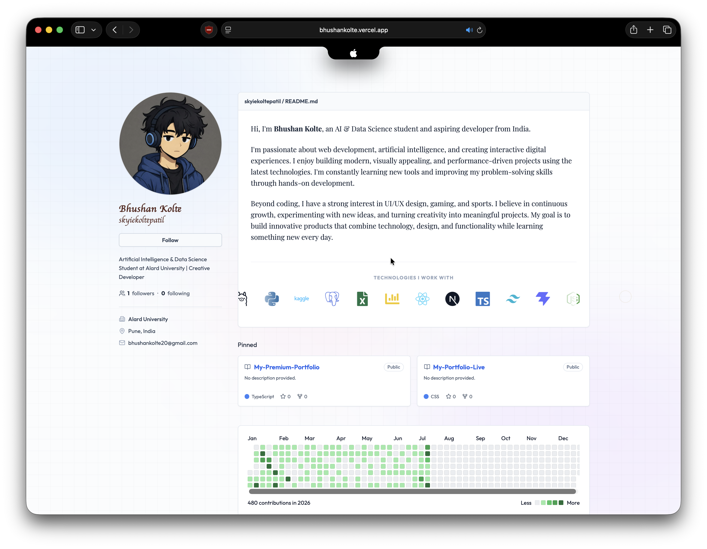

# 👨‍💻 My Premium Portfolio

**🌐 Live Website:** [bhushankolte.vercel.app](https://bhushankolte.vercel.app)

Welcome to my personal portfolio! This website is a comprehensive, interactive digital representation of my professional journey, skills, and personality. It was meticulously crafted to provide visitors with an engaging and visually stunning experience.

## 🌟 About the Website

This portfolio is more than just a digital resume; it's a showcase of my passion for modern web development and design. Every page, interaction, and animation has been thoughtfully implemented to create a memorable user experience. The site leverages cutting-edge web technologies to deliver smooth performance and high-fidelity graphics.

### Key Highlights:

- **Immersive Visuals**: The website features a sleek, modern aesthetic with glassmorphism effects, custom typography, and carefully curated color palettes.
- **Interactive 3D Elements**: Using WebGL and 3D rendering, the portfolio includes rich, interactive canvases that respond to user input, providing a unique dimension to the browsing experience.
- **Fluid Animations**: From page transitions to micro-interactions, the site is animated using industry-standard libraries to ensure every scroll, hover, and click feels natural and polished.
- **Dynamic Content**: Explore different facets of my life and career through dedicated sections for my professional experience, personal hobbies, and even some fun interactive mini-games.
- **Responsive & Accessible**: The design seamlessly adapts to any screen size, ensuring a flawless experience whether you are viewing it on a desktop, tablet, or smartphone.

## 🛠️ Built With

This project represents the culmination of various modern web technologies, chosen for their performance, flexibility, and developer experience:

- **Core**: React 19 and TypeScript for a robust, type-safe foundation.
- **Styling**: Tailwind CSS combined with custom CSS for rapid, maintainable, and highly customized styling.
- **Animation Engine**: Framer Motion and GSAP orchestrate the complex choreography of elements entering and exiting the viewport.
- **3D Graphics**: Three.js, OGL, and Unicorn Studio React power the advanced visual effects and 3D scenes.
- **Routing**: React Router DOM handles the seamless, single-page application navigation.

## 📬 Connect With Me

Feel free to explore the website to learn more about my background, view my latest projects, or just to play around with the interactive elements! 

If you'd like to get in touch, you can reach out to me directly through the contact section on the website.
